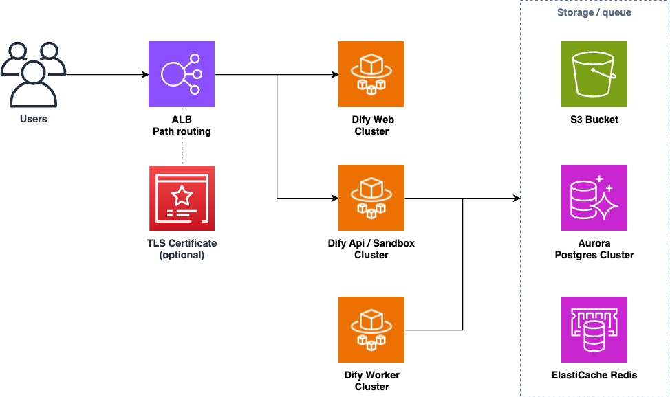

# Dify on AWS with CDK

Deploy [Dify](https://dify.ai/), an LLM app development platform, using AWS managed services with AWS CDK.



Key Features:

* Fully managed services requiring less maintenance effort
    * Aurora servereless v2, ElastiCache, ECS Fargate, etc.
* Cost effective architectural decisions
    * allow to use NAT instances instead of NAT Gateway, use API Gateway instead of ELB, and Fargate spot capacity by default
* Natively integrate with Bedrock using IAM role

## Prerequisites
You must have the following dependencies installed to deploy this app:

* [Node.js](https://nodejs.org/en/download/) (v18 or newer)
* [Docker](https://docs.docker.com/get-docker/)
* [AWS CLI](https://docs.aws.amazon.com/cli/latest/userguide/getting-started-install.html) and IAM profile with Administrator policy

## Deploy
You can adjust configuration parameters such as AWS regions by modifying [`bin/cdk.ts`](bin/cdk.ts). Please also check [`DifyOnAwsStackProps` interface](./lib/dify-on-aws-stack.ts) for the available parameters.

Then you can run the following commands to deploy the entire stack.

```sh
# install npm dependencies
npm ci
# bootstrap the AWS account (required only once per account and region)
npx cdk bootstrap
# deploy the CDK stack
npx cdk deploy
```

The initial deployment usually takes about 20 minutes. After a successful deployment, you will get the URL for the app.

```
 ✅  DifyOnAwsCdkStack

✨  Deployment time: 326.43s

Outputs:
DifyOnAwsCdkStack.ApiGatewayApiEndpoint015055E7 = https://xxxxxxxxx.execute-api.us-east-1.amazonaws.com
```

You can open the URL with a browser and get started!

## Setup Dify to use Bedrock

After logged in, you can setup Dify to use Bedrock LLMs.

> [!IMPORTANT]  
> Before setting up models in Dify, you have to **enable models** you want to use in Bedrock management console. Please read [this document](https://docs.aws.amazon.com/bedrock/latest/userguide/model-access.html#model-access-add) for more details.

Go to settings by clicking the right-top profile, click `WORKSPACE -> Model Provider`, and select `AWS Bedrock model`.

IAM policies are already configured properly, so you can just select a correct AWS region (where the models are enabled) to use Bedrock models, and click `Save`.


## Clean up
To avoid incurring future charges, clean up the resources you created.

```sh
npx cdk destroy --force
# If you encountered an error during the deletion, please retry. It happens sometimes.
```

## License
All the code in this repository is MIT-licensed. However, you should also check [the license of Dify](https://github.com/langgenius/dify/blob/main/LICENSE).

## Acknowledgement
This CDK code is heavily inspired from [dify-aws-terraform](https://github.com/sonodar/dify-aws-terraform).
